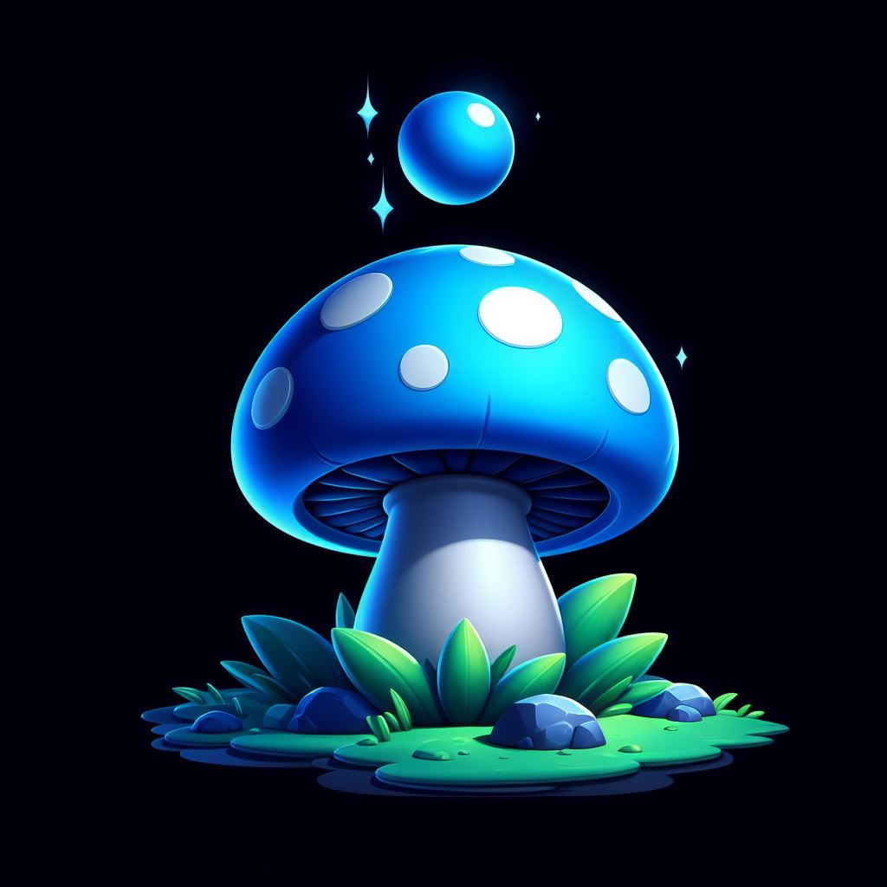

# Blue Mushroom Game

## Description

Welcome to Mushy Washy! This is a game where you move your basket to collect mushrooms. The more mushrooms you collect, the heavier your basket becomes.

## Instructions

Press and hold the up key to move your basket and collect your mushrooms.

## Installation

To install the game, follow these steps:

1. Clone the repository: `git clone https://github.com/yourusername/bluemushroomgame.git`
2. Navigate to the project directory: `cd bluemushroomgame`
3. Install the dependencies: `npm install`
4. Start the server: `npm start`

## Usage

To play the game, open the `welcome.html` file in your web browser.

## Server Routes

The server uses Express.js and serves static files from the 'public' directory.

## Feature Flags

The server uses the LaunchDarkly SDK for feature flagging. Each user is assigned a unique key and is part of the 'beta_testers' group. Feature flags can be used to enable or disable features for specific users or groups of users.

## Contributing

If you want to contribute to this project, please submit a pull request.

## License

This project is licensed under the MIT License.